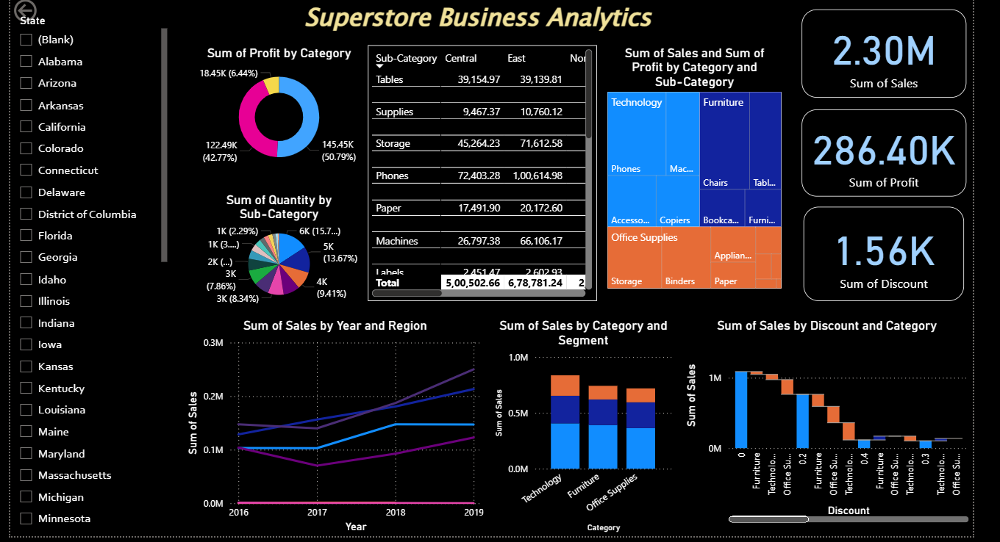

# Power BI SuperStore Analysis

Interactive Power BI report built on the Superstore dataset, highlighting key business trends in sales, profits, and categories across regions and years (2016-2019). This dashboard uncovers actionable insights for optimizing inventory, pricing, and regional strategies.

## Key Insights
- **Total Sales**: $2,297,201 – Steady growth, with a 51% increase from 2016 to 2019.
- **Total Profit**: $286,397 – Driven by Technology (50.8% of profits), despite Furniture's high sales volume.
- **Top Performers**: Phones and Copiers in Technology sub-categories lead profits.
- **Challenges**: High discounts (>0.3) cause losses in Furniture; West region dominates sales (32%).
- **Growth Opportunity**: Focus on Tech/Office Supplies could boost profits 20-30%.

*Screenshot of the interactive dashboard showing sales by year/region, profit by category, and discount impacts.*

## Files Included
- **Sample-SuperStore.xlsx**: Raw dataset (9,995 orders; sheets: Orders, People, Returns). Key columns: Order ID, Sales, Quantity, Discount, Profit, Category, Region, Sub-Category.
- **SuperstoreDashboard.pbix**: The full Power BI report file – load into Power BI Desktop for interactivity (slicers for states, years, etc.).
- **dashboard-preview.png**: Static image of the dashboard for quick reference.

## How to Get Started
1. **Download and install Power BI Desktop** (free) from [Microsoft](https://powerbi.microsoft.com/desktop/).
2. **Open SuperstoreDashboard.pbix**.
3. **Refresh data**: Home > Refresh (connects to the Excel file).
4. **Explore**:
   - Use slicers for filtering (e.g., by State or Discount).
   - Drill down on visuals for sub-category details.
5. **Customize**: Add DAX measures (e.g., YoY Growth = `DIVIDE([Total Sales] - CALCULATE([Total Sales], SAMEPERIODLASTYEAR('Orders'[Order Date])), CALCULATE([Total Sales], SAMEPERIODLASTYEAR('Orders'[Order Date])))`).

## Data Source & Credits
This analysis uses the public Superstore Sales dataset from [Kaggle](https://www.kaggle.com/datasets/rohitsahoo/sales-forecasting) (CC BY-SA 4.0 license). All visualizations and insights are original work by GraceDeepi08. Thanks to the community for the open data!

## Tech Stack
- **Power BI Desktop**: For data modeling, DAX queries, and interactive visuals.
- **Excel**: Data preparation and source.
- **GitHub**: Version control and sharing.

## Contributing
Feel free to fork this repo, suggest improvements (e.g., add forecasting visuals), or open an issue for questions. Pull requests welcome!

Built with ❤️ by [GraceDeepi08](https://github.com/GraceDeepi08). 
---

*Last updated: October 23, 2025*
